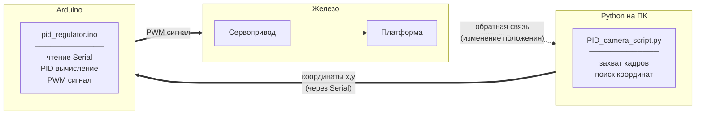
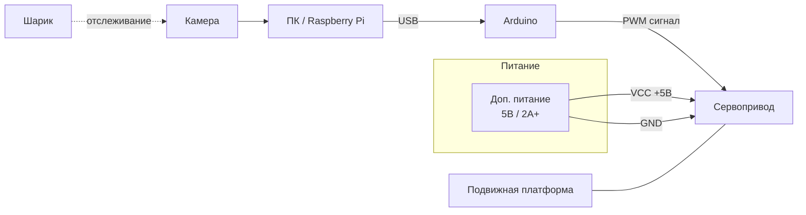

# PID регулятор

Проект для научной конференции: **Инженеры будущего (2025)**

---

## О проекте

Проект представляет собой полностью готовый стенд для стабилизации инертных объектов на подвижной плоскости.

### Компоненты стенда

| Компонент | Назначение |
|-----------|------------|
| Камера | Отслеживание положения шарика |
| ПК / Raspberry Pi | Обработка видео, вычисление координат |
| Arduino | PID-регулятор, управление сервоприводом |
| Сервопривод | Поворот платформы |
| Дополнительное питание (5В / 2А+) | Питание сервопривода |
| Макетная плата | Разводка питания и сигналов |
| Подвижная платформа | Физическая основа стенда |

### Принцип работы

1. Камера захватывает видео и передает на ПК
2. Python-скрипт обрабатывает кадры, находит координаты шарика
3. Координаты отправляются в Arduino через Serial
4. Arduino вычисляет PID-коррекцию и подает PWM-сигнал на серву
5. Серва поворачивает платформу, возвращая шарик в центр

---
## Принципиальная схема работы

## Схема подключения

---

### Cтруктура

pid_regulator.ino - Скетч для Arduino (PID + серво)

PID_camera_script.py - Скрипт для камеры (OpenCV)

requirements.txt - Python-зависимости

README.md - Этот файл

---

